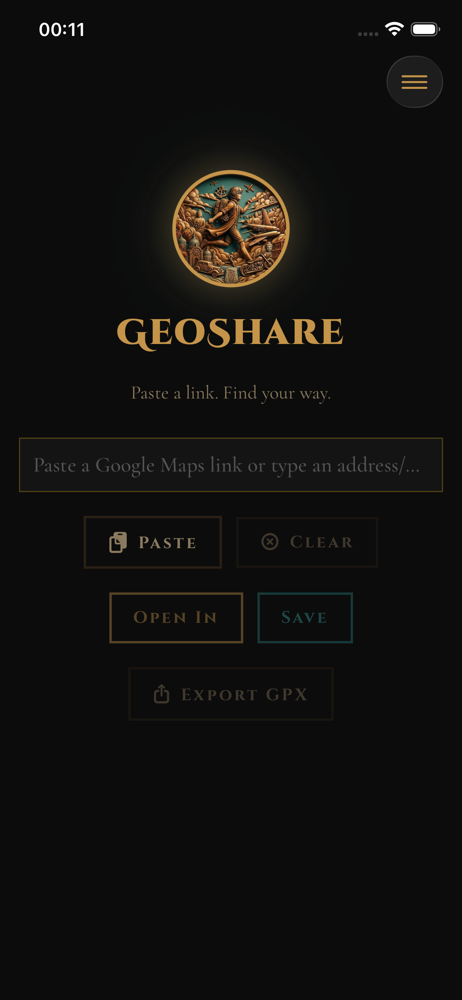

# AdvaetaGeoShare

A small iOS app for one job: turn a Google Maps link (or a plain address/postcode) into a location open in OsmAnd, Google Maps, or Waze — whichever you actually use. Its original purpose was closing OsmAnd's gap with Google Maps' address search (like UK postcodes), without needing OsmAnd itself to change; it's grown from there.

Inspired by [GeoShare for Android](https://github.com/jakubvalenta/geoshare), which does the same job — convert/redirect map links between apps — as a full-featured, longstanding Android app. This is an iOS-native take on the same idea, built from scratch rather than a port.

Paste a link, tap a button, you're there.



## Features

- **Paste a Google Maps link** — plain links (`@lat,lng`, `q=lat,lng`), precise place pins (`!3d..!4d..`), and short links (`maps.app.goo.gl`, `goo.gl/maps`, `g.co/kgs`), resolved by following redirects.
- **Multi-stop directions links** — a `/maps/dir/...` link with several stops opens the full route.
- **Type a plain address or postcode** — anything that isn't a recognizable Maps link falls back to Apple's on-device geocoder (`CLGeocoder`), so postcodes and addresses work the same as pasted links.
- **Address autocomplete** — as you type non-URL text, a dropdown of matching addresses/places appears (via `MKLocalSearchCompleter`); tap one to fill it in.
- **Open in OsmAnd, Google Maps, or Waze** — pick per tap via the "Open In" menu. Each targets its provider's officially documented deep-link format; Waze has no concept of multi-stop routes so a route falls back to just its destination there.
- **Save places or routes** — name and store a single location or a multi-stop route, choosing which app it should open in.
  - For a single point, optionally toggle "start navigating automatically" (begins turn-by-turn guidance from your current location the moment you open it).
  - For a multi-stop route, optionally toggle "save destination only" if you just want the endpoint saved as a place rather than the whole route (useful since a Google Maps "directions to X" link can resolve as a 2-stop route even when you only care about X).
- **My Places / My Routes** — separate lists (single locations vs multi-stop routes) under the menu button, each with swipe-to-delete.
- **Recent searches** — the last 5 locations you actually opened appear on the main screen for one-tap reopening (only recorded on a confirmed successful open, not every attempt), each with a copy-to-clipboard button.
- **Export / Import backup** — from the menu, export all saved places/routes to a JSON file (via the share sheet — save to Files, AirDrop, email, etc.) and import one back in later. iOS deletes an app's local data on uninstall with no built-in way to preserve it, so this is the (free) way to carry your saved places across a reinstall or a new device; re-importing the same backup is safe/idempotent.
- **Export as GPX** — turn the current input (a pasted link or typed address) into a standard `.gpx` file via the share sheet, for loading into GPS devices or other navigation/mapping apps. A single point becomes a `<wpt>`; a multi-stop route becomes an ordered `<rte>` of `<rtept>`s.
- **Paste / Clear buttons** next to the input field.

## Setup

Requires a Mac with Xcode installed.

1. Install [XcodeGen](https://github.com/yonaskolb/XcodeGen): `brew install xcodegen`
2. Generate the Xcode project: `xcodegen generate`
3. Open `AdvaetaGeoShare.xcodeproj` in Xcode.
4. Select your own team under Signing & Capabilities (needed to run on a real device — Simulator doesn't need this, but the map apps this targets can't be installed on Simulator either, so a real device is the only way to see the full flow end-to-end).
5. Build and run.

The `.xcodeproj` is generated, not committed — re-run `xcodegen generate` after pulling changes to `project.yml` or after adding/removing source files.

There's no packaged binary release — iOS requires either a paid Apple Developer account (TestFlight) or building from source to install on a device, so building from source via the steps above is the only way to try it right now.

### Command line

```bash
xcodebuild build -project AdvaetaGeoShare.xcodeproj -scheme AdvaetaGeoShare -destination 'platform=iOS Simulator,name=iPhone 16e'
```

## Running tests

```bash
xcodebuild test -project AdvaetaGeoShare.xcodeproj -scheme AdvaetaGeoShare -destination 'platform=iOS Simulator,name=iPhone 16e'
```

## Usage

1. Copy a Google Maps link (or its share text), or just have an address/postcode ready.
2. Open AdvaetaGeoShare and paste or type it into the text field (the Paste button reads your clipboard directly; address autocomplete suggests matches as you type).
3. Tap **Open In** to pick OsmAnd, Google Maps, or Waze and go there now, **Save** to name it, pick its app, and keep it in **My Places**/**My Routes** for later, or **Export GPX** to get it as a `.gpx` file via the share sheet.
4. Tap the menu button (top right) for **My Places**, **My Routes**, and backup export/import.

If the chosen app isn't installed, the app tells you so rather than failing silently.

## Requirements

- iOS 16.0+
- At least one of [OsmAnd](https://apps.apple.com/app/osmand-maps-travel-navigate/id934850257), Google Maps, or Waze installed, to actually open locations

## Design

Visual identity matches [advaetarides.github.io](https://advaetarides.github.io) — the bronze medallion logo, Cinzel/Cormorant Garamond typography, and the site's bronze/teal/black palette. Font files are static-weight instances extracted from Google Fonts' variable font sources (OFL-licensed), since the fonts aren't bundled anywhere in the source project itself.

## FAQ

**Why isn't this on the App Store?**

Publishing to the App Store requires enrolling in the Apple Developer Program, which costs $99/year. This is a free, source-available project — building it yourself via the steps above is free and takes a few minutes.
